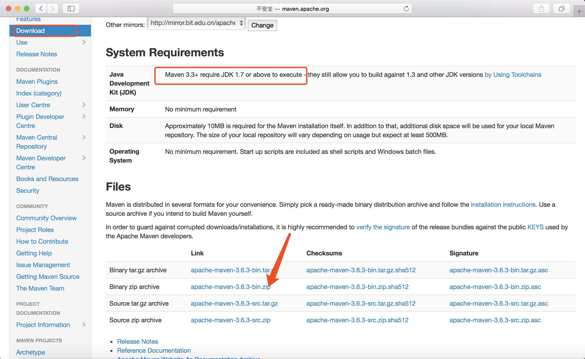
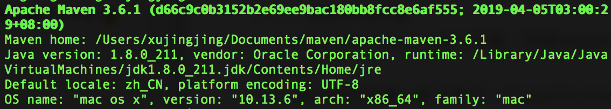

### Maven
#### 1. What
Maven是当前最受欢迎的Java项目管理构建自动化综合工具，类似Java以前的Ant、node.js中npm、.Net中的nuget、世上最好语言（PHP）中的Composer。

Maven这个单词来自于犹太语，意为知识的积累。

 

#### 2. Why
1. 起初每个Java项目的目录结构都没有一个统一的标准，配置文件到处都是，单元测试代码应该放在哪里也没有一个权威。
2. 在开发中经常需要依赖第三方的包，包与包之间存在依赖关系，各版本之间还有兼容性问题，有时还需要将依赖包升级或降级，项目复杂到一定程度时急需需要一个规范的包管理。
3. 使用Ant可以自动化的完成编译、测试、打包等任务，Ant很优秀，但是编写Ant的XML脚本绝不优秀。

因此，伟大的Jason(Maven之父Jason Van Zyl) 给我们带了一种全新的项目构建方式、让我们的开发工作更加高效。

> **Maven主要做了两件事：**
> 1. 统一开发规范与工具
> 2. 统一管理jar包 **

如果没有Maven，可能不得不经历：
1. 如果使用了spring，去spring的官网下载jar包；如果使用hibernate，去hibernate官网下载jar包；如果使用Log4j，去Log4j的官网下载jar包......
2. 当某些jar包有依赖的时候，还要去下载对应依赖jar包
3. 当jar包依赖有冲突时， 不得不一个一个的排查
4. 执行构建时，需要使用Ant写出很多重复的任务代码
5. 当新人加入开发时，需要copy大量jar包，重复进行构建
6. 进入测试时，需要一个一个的运行检查

有了Maven：
1. 依赖的管理：仅仅通过jar包的几个属性，就能确定唯一的jar包，在指定的文件**pom.xml**中，只要写入这些依赖属性，就会自动下载并管理jar包
2. 项目的构建：内置很多插件与生命周期，支持多种任务，如校验、编译、测试、打包、部署、发布.....
3. 项目的知识管理：管理项目相关的其他内容，比如开发者信息，版本等等

#### 3. Where
[官网地址](http://maven.apache.org/)
[菜鸟教程](https://www.runoob.com/maven/maven-tutorial.html)
[Maven库](http://repo2.maven.org/maven2/ )
[中央仓库资源-1](http://mvnrepository.com/)
[中央仓库资源-2](https://search.maven.org/)

#### 4.How
##### 安装与配置 
> 1. 官方下载安装包
>> 浏览器中打开[下载地址](http://maven.apache.org/download.cgi) 
>> 
> 2. 配置环境变量
>> 
注意：安装maven之前，必须确保您已经安装了JDK

>> 假设我们在第一步下载了一个apache-maven-3.1.1-bin.zip文件，现在将其解压到D:/tools目录下，假设我们将解压后的目录重命名为maven，这样Maven的根目录就是D:/tools/maven了
>> 有两个环境变量可以配置
>> * M2_HOME = D:/tools/maven （方式与配置JAVA_HOME一致）
>> * MAVEN_OPTS = -Xms128m -Xmx512m
>> 以上M2_HOME是必须要配置的，如果想让Maven运行速度提升，可以根据情况来设置MAVEN_OPTS。
>> 如果你完成了上述操作，打开cmd，输入：**mvn -v**，如果可以看到
>> 恭喜您！ Maven安装成功！
> 3. 了解Maven仓库
>> 

