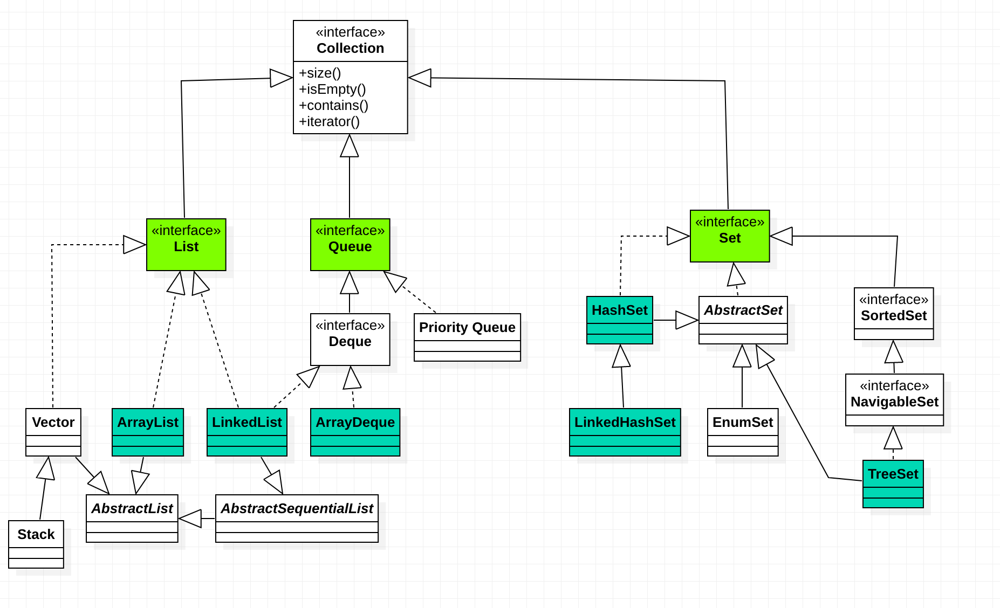
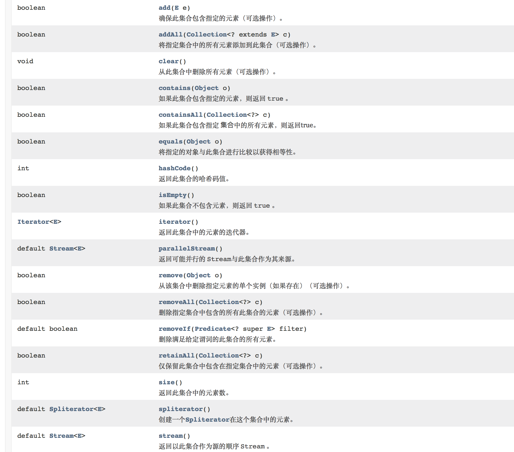
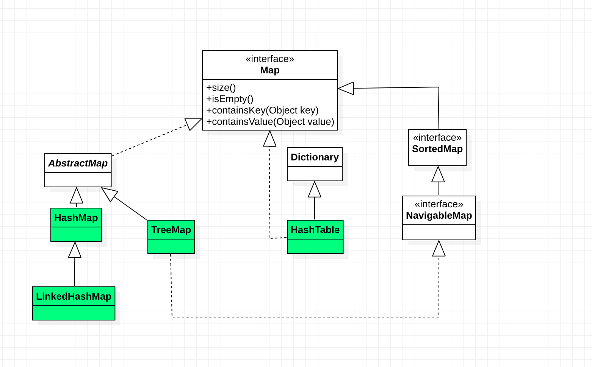
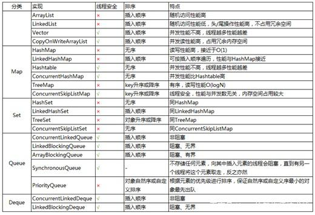

#Java集合框架
##1.简介
集合可以看作是一种容器，用来存储对象信息，所有集合类都位于java.util包下，支持多线程的集合类位于java.util.concurrent包下
##2.数组与集合的区别
| 数组                               | 集合                       |
| ---------------------------------- | -------------------------- |
| 数组长度不可变化                   | 可以保存长度不确定的数据   |
| 不能保存具有映射关系的数据         | 可以保存具有映射关系的数据 |
| 数组元素可以是基本类型也可以是对象 | 只能保存对象               |

##3.集合结构

图片来源:https://www.cnblogs.com/TestMa/p/10641367.html
集合宏观分类分为**Collection**和**Map**

1. Collection是一个接口，是高度抽象出来的集合，包含了集合的基本操作和属性。Collection包含两个主要的字接口**List**和**Set**
2. Map是一个映射接口，即key-value键值对。Map中的每个元素包含"一个key"和"key对应的value"。AbstractMap实现了Map接口的大部分API，HashMap，TreeMap，WeakHashMap都继承与它。Hashtable继承与Dictionary。
3. Arrays和Collections是操作数组、集合的两个工具类。
###3.1 Collection接口

Collection接口是处理对象集合的根接口，其中两个主要的子接口是List和Set，**Map不是Collection的子接口**
Collection常用方法


####3.1.1 List集合
List集合代表一个**有序**且**元素可重复**的集合，集合的每个元素都有其对应的顺序索引。默认按照元素的添加顺序设置元素的索引，可以通过索引（类似于数组下标）来访问指定位置的集合元素。
实现List接口的集合主要有：**ArrayList**，**LinkedList**，**Vector**，Stack
**1. ArrayList**
ArrayList是一个***动态数组***，它允许任何符合规则的元素插入（包括null）。每个ArrayList都有一个初始容量（10），该容量代表了容器的大小。随着容器中的元素增加，容器的大小也会随着增加，每次向容器增加元素时同时会进行容量检查，当快溢出时，就会进行扩容操作。因此如果我们明确所插入的元素数量，最好指定一个初始容量值，避免过多的扩容操作带来的性能问题。
Java当中容量分配的公式为：((旧容量 * 3) / 2) + 1
PS：C#中是直接翻倍
**ArrayList擅长于随机访问（检索效率高），ArrayList是非同步的（线程不安全）**
**2.LinkedList**
LinkedList是一个**双向链表**，与ArrayList的不同LinkedList**不能随机访问**，它所有的操作都需要按照双向链表的需要执行。在列表中索引的操作将从开头或者结尾遍历列表（从靠近指定索引的一端），这样做的好处就是以较低的代价在List中进行插入和删除操作。
LinkedList也是**非同步的**，如果多个线程访问一个List，必须自己实现访问同步，如：
```java
List list = Collections.synchronizedList(new LinkedList<>());
```
**3.Vector**
Vector的操作基本和ArrayList一样，区别在于Vector是**同步的**，即**线程安全的动态数组**

**4.Stack**
Stack继承自Vector，实现了一个后进先出的堆栈。Stack提供了5个额外的方法是的Vector得以被当作堆栈使用。
>* 基本的push和pop
>* peek得到栈顶元素
>* empty判断堆栈是否为空
>* search检测一个元素在堆栈中的位置

Stack刚创建是空栈。
####3.1.2 Set集合
Set是**无序**且**元素不重复**的集合。它允许null的存在但是仅有一个。虽然Set是无序的，但是元素在set中的位置是由该元素的HashCode决定的，每个元素的位置其实的固定的
Set的元素不重复指的是任意两个元素e1和e2要满足**e1.equals(e2) =false**，并且Set 集合中的去重复与hashcode和equals方法是直接相关的。假如存在两个不同的对象o1和o2，正常情况是可以放入Set中，但是如果o1和o2都重写了hashcode和equals方法且重写后hashcode和equals的方法是相同的话，那o1和o2不能同时放入Set中。

Set接口有三个具体实现类**HashSet**，**LinkedHashSet**，**TreeSet**

**1.HashSet**
a). HashSet是一个**没有重复元素**的集合，它是有HashMap实现的，**无序**，不保证元素的顺序（元素的插入顺序和输出顺序不一致），允许使用null元素。
b). HashSet是非同步的，如果多个线程同时访问一个HashSet，而其中至少一个线程修改了该Set，那么必须保证外部同步。
c). HashSet是通过Hash算法来存储元素，具有很好的存取和查找性能。
d). HashSet的实现方式大致是通过一个HashMap存储元素，元素存放在HashMap的key中，value统一使用Object对象。
**使用中应注意：**

>* HashSet允许存入null，但只能存入一个
>* HashSet是无序的但存储元素位置是固定的（HashSet底层是基于Hash算法实现，使用了HashCode，所以存入元素的位置是固定的）
>* 谨慎操作可变对象。如果Set中的可变元素改变了自身状态导致Object.equals(Object)=true，将会出现问题。

**LinkedHashSet**
LinkedHashSet继承HashSet，底层是LinkedHashMap实现的，**有序，非同步**
LinkedHashSet同样是根据元素的hashcode值来决定元素的存储问题，但是同时**使用了链表维护元素的次序**，使得元素看起来像是以插入顺序保存的，当遍历LinkedHashSet将会以元素的添加顺序访问集合元素。

**TreeSet**
TreeSet是一个月**有序集合**，底层是**基于TreeMap**实现的，**非线程安全**，它可以确保集合元素处于排序状态。支持两种排序方式，**自然排序（默认）和定制排序**，在构造TreeSet时，若使用无参构造函数，则使用自然比较器，如需要自定义比较器，则需要使用带比较器的参数。
**注意**
TreeSet集合不是通过hashcode和equals函数来比较元素的，它是通过compare或者compareTo函数来判断元素是否相等（通过判断两个对象的id，相同的id判断为重复元素，不会被加入到集合中）。

###3.2 Map
Map是由一系列键值对组成的集合，提供了key到value的映射。保证了key与value之间一一对应关系。不存在相同的key。Map接口的常见实现有**HashMap**，**LinkedHashMap**，**TreeMap**，**HashTable**，**SortedMap**， **WeakHashMap**


####3.2.1 HashMap
以哈希表数据结构实现，通过put()和get()方法存储和获取对象。当将键值对传递给put()方法是，它调用key对象的hashCode()方法来计算hashCode值，然后找到bucket位置来存储值对象。当get对象时，通过key对象的equals()方法找到正确的键值对，然后返回对象。HashMap使用链表(拉链式)来解决碰撞问题，当发生碰撞了，对象将会存储在链表的下一个节点中。

####3.2.2 HashTable
HashTable大部分实现和HashMap相同，采用拉链法实现哈希表，**继承与Dictionary，同步**
HashTable的一个实例有两个影响其性能的参数：初始容量和负载因子，初始容量时哈希表的创建容量，负载因子时哈希表中的bucket数。

####3.2.3 LinkedHashMap
LinkedHashMap是HashMap的一个子类，**不同步**，它保留**插入顺序**，但**不保证映射顺序恒久不变**允许使用null值和null键。
LinkedHashMap维护着一个运行与所有条目的双重链表列表，此链接列表定义了迭代顺序，该迭代顺序可以是**插入顺序（默认）**或者**访问顺序**
如果指定了按照访问顺序排序，那么调用get方法之后，会将这次访问的元素移至链表尾部，不断访问可以形成按照访问顺序排序的链表。

####3.2.4 TreeMap和SortedMap
TreeMap实现了SortedMap，保证了有序性。
TreeMap是一个有序的key-value集合，**非同步**，基于**红黑树**实现，每一个key-value节点作为红黑树的一个节点，TreeMap存储时会进行排序，会根据key来对key-value键值对进行排序，排序方式分为两种：**自然排序和定制排序**
自然排序：TreeMap中所有的key必须实现Comparable接口，并且所有的key都应该是同一个类的对象，否则会报ClassCastException异常。
定制排序：定义TreeMap是，创建一个comparator对象，该对象对所有的treeMap中的所有key值进行排序，采用定制排序的时候不需要TreeMap中的所有key必须实现Comparable接口。

TreeMap判断两个元素相等的标准：两个key通过compareTo()方法返回0，则认为这两个key相等。

如果使用自定义的类来作为TreeMap中的key值，且想让TreeMap能够良好的工作，必须重写自定义类中的equals方法，TreeMap中判断相等的标准是：两个key通过equals方法返回true，并且通过compareTo()方法比较应该返回为0。

####3.2.5 WeakHashMap
与HashMap相同，WeakHashMap也是一个散列表，它存储的内容也是键值对，并且键值都可以为null。不过WeakHashMap的**键是"弱键"**，当某个键不再正常使用时，会被从WeakHashMap中被自动移除。实现的原理：
**主要是通过WeakReference和ReferenceQueue实现的**，WeakHashMap的key是WeakReference类型的，ReferenceQueue是一个队列，保存被GC回收的弱键
主要步骤是：
a. 新建WeakHashMap，将键值对添加到WeakHashMap中，实际上，WeakHashMap是通过数组table保存Entry（键值对），每一个Entry实际上是一个单向链表，即Entry是键值对链表。
b. 当某弱键不再被其它对象引用，被GC回收时，这个弱键也同时被添加到ReferenceQueue队列中
c. 当下一次我们需要操作WeakHashMap时，会先同步table和queue，table保存全部键值对，queue保存被回收的键值对，同步两者就是删除table中被GC回收的键值对。
WeakHashMap是不同步的，可以使用Collections.synchronizedMap方法构造同步。

###3.3 Iterator
Iterator是一个接口，它是集合的迭代器，集合可以通过Iterator去遍历集合中的元素，它提供了API接口如下：
boolean hasNext()：判断集合是否存在下一个元素。
Object next()：返回集合里下一个元素
void remove()：删除集合里上一次next方法返回的元素
**注意**：
Iterator只能单向移动
Iterator.remove()是唯一安全的方式来再迭代过程中修改集合，并且每调用一次next()方法，remove()方法只能被调用一次。

###3.4 ListIterator
ListIterator是一个功能更加强大的迭代器，它继承与Iterator接口，只能用于List类型访问，可以通过调用listIterator()方法产生一个指向List开始处的ListIterator，还可以调用listIterator(n)方法创建一个一开始就指向列表索引为n的元素处的ListIterator。
ListIterator可以：
1. 双向遍历（向前/向后遍历）
2. 获得迭代器在列表中当前位置的前一个和后一个元素索引
3. 可以使用set()方法替换它访问过的最后一个元素
4. 可以使用add()方法在next()方法返回的元素之前或者previous()方法返回的元素之后插入一个元素。

##4.异同点

###4.1 ArrayList和LinkedList

| ArrayList                                      | LinkedList                   |
| ---------------------------------------------- | ---------------------------- |
| 基于数组                                       | 基于链表                     |
| 查询快，增删慢(需要移动插入点及之后的所有数据) | 增删快，查询慢(需要移动指针) |

注：若只对单条数据插入和删除，ArrayList优于LinkedList

###4.2 HashTable与HashMap
相同点：
>* 都是存储键值对的散列表，都是采用拉链法来实现的

不同点：
>* 历史原因：HashTable是基于Dictionary类，HashMap是Map的实现
>* 同步性：HashTable线程安全， HashMap线程不安全
>* null值处理：HashTable的key-value都不能为null，HashMap都可以为null
>* 基类不同：HastTable继承Dictionary，HashMap继承与AbstractMap
>* 支持的遍历种类不同：HashTable支持Iterator和Enumeration遍历，HashMap只支持Iterator

###4.3 HashMap、HashTable、LinkedHashMap和TreeMap比较
HashMap：无序，允许null值，不同步，访问速度快
HashTable：无序，不允许null值，不同步
LinkedHashMap：有序，允许null，不同步
TreeMap：根据键排序，实现是红黑树，不允许key为null，非同步

当HashMap容量很大，实际数据较少时，遍历起来可能会比LinkedHashMap慢，因为LinkedHashMap的遍历速度只和实际数据有关，和容量无关，而HashMap的遍历速度和他的容量有关
一般情况下，我们用的最多的是HashMap，HashMap里面存入的键值对在取出的时候是随机的，它根据键的HashCode值存储数据，根据键可以直接获取它的值，具有很快的访问速度。在Map 中插入、删除和定位元素，HashMap 是最好的选择。
TreeMap取出来的是排序后的键值对。如果要按自然顺序或自定义顺序遍历键，那么TreeMap会更好。
LinkedHashMap 是HashMap的一个子类，如果需要输出的顺序和输入的相同，那么用LinkedHashMap可以实现，它还可以按读取顺序来排列，像连接池中可以应用。 


[图片来源]https://baijiahao.baidu.com/s?id=1635960586900914735&wfr=spider&for=pc