### 1.简介
本文主要介绍使用Idea创建一个多Model工程的SpringBoot项目
### 2.创建步骤
#### 2.1 新建Maven工程
> 打开Idea
> > 1. 操作路径：File-> new -> project
> > 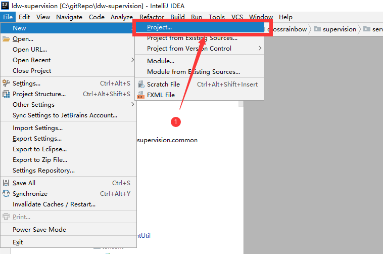
> > 2. 选择maven，点击next
> > 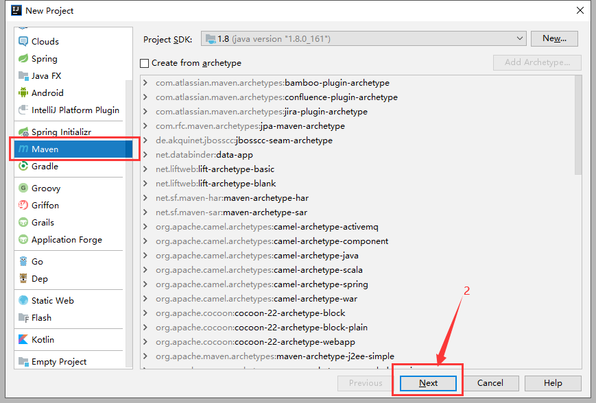
> > 3. 填写工程信息，点击next
> > 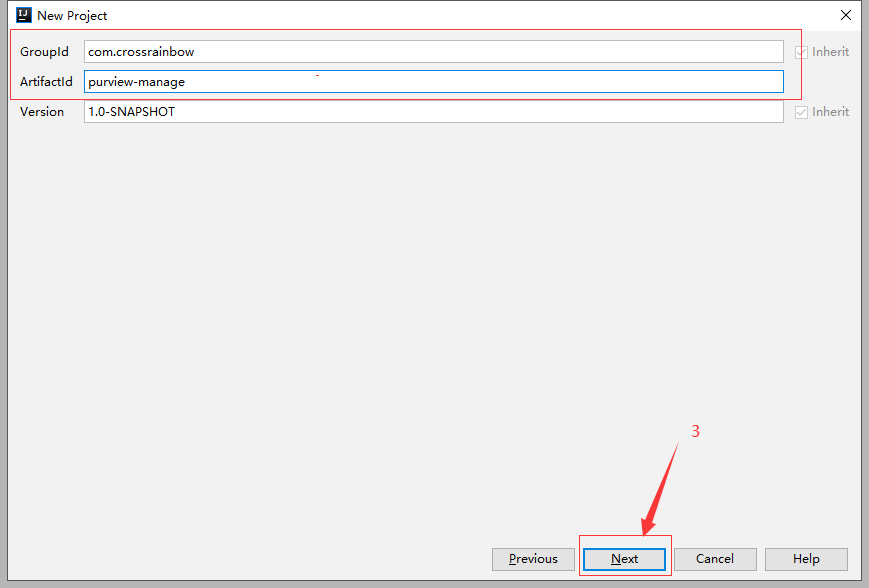
> > 4. 确认工程名后点击finish将看到已建好的工程
> > 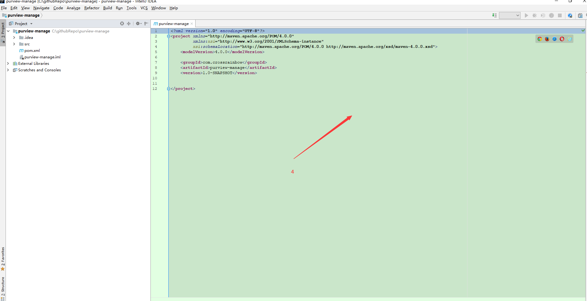

#### 2.2 创建Model
> 删除maven工程的src文件夹，并在pom.xml增加
> ````xml 
> <packaging>pom</packaging>
> ````
> 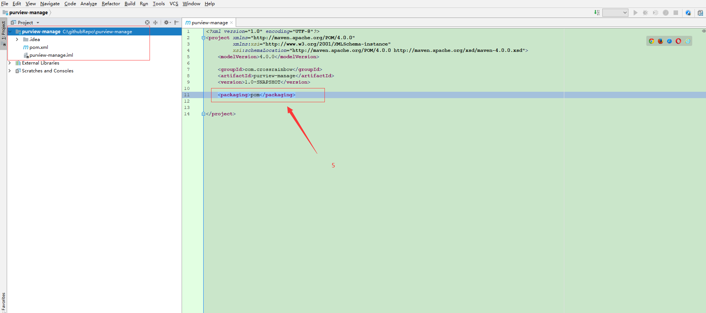
>> 1. 在根项目上点击右键，选择new-> Model
>> 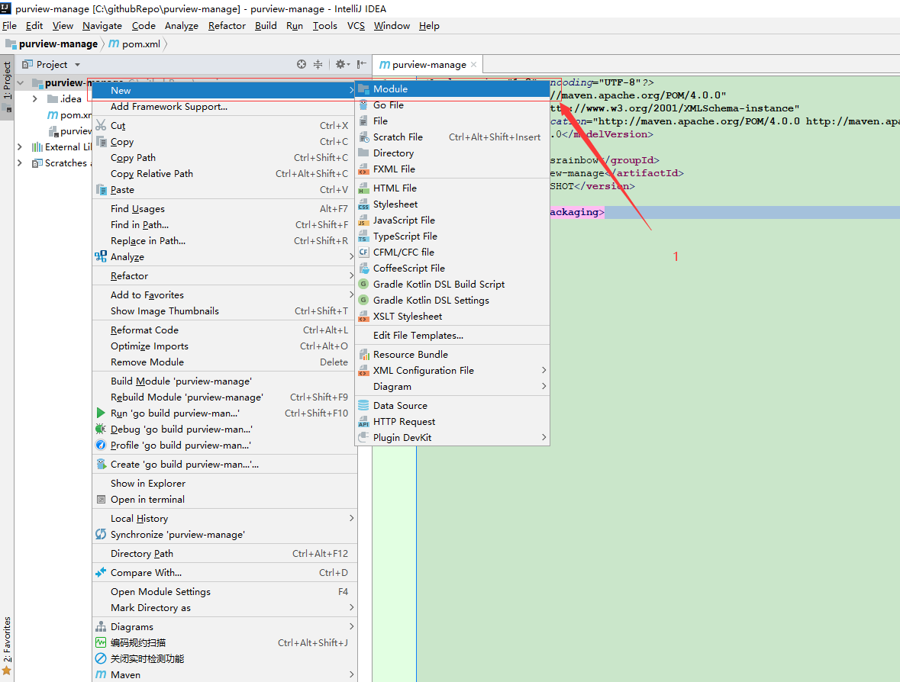
>> 2. 选择Spring Initializr，点击next
>> 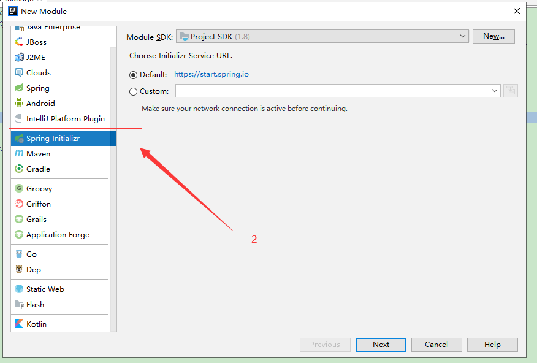
>> 3. 填写model信息，点击next
>> 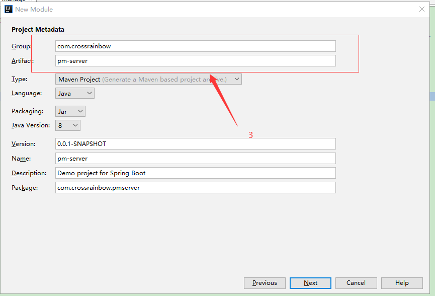
>> 4. 选择依赖项，点击next
>> 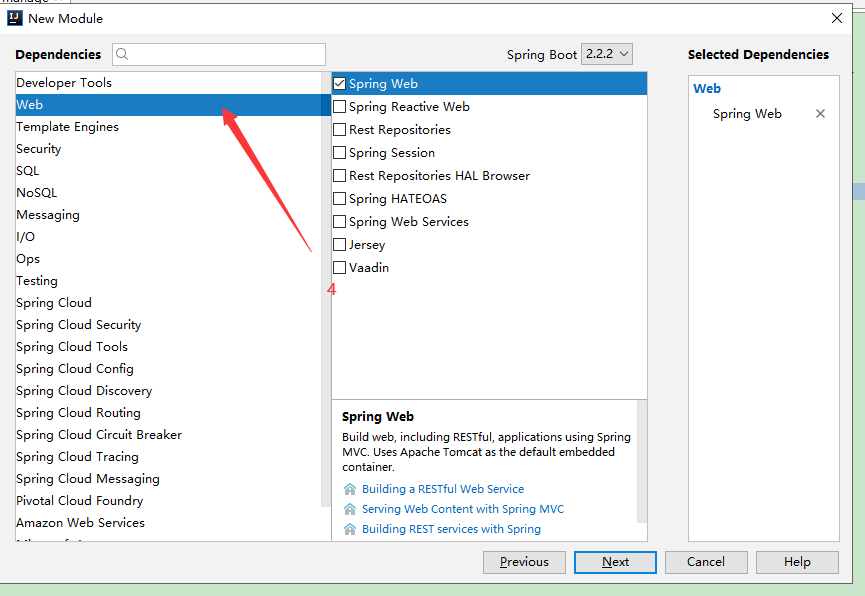
>> 5. 确认Model信息后点击finish
>> 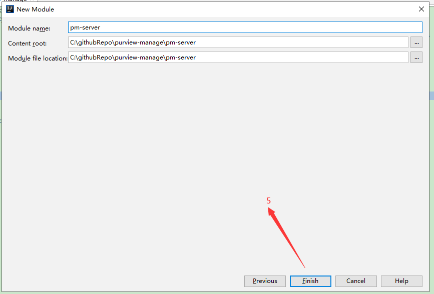
>> 完成之后的目录结构如下
>> 
>> 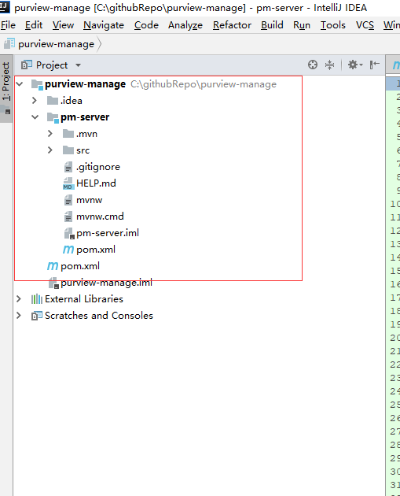

> 按照上述五个步骤继续创建下一个Model，全部创建完成之后目录结构类似如下
>
> > 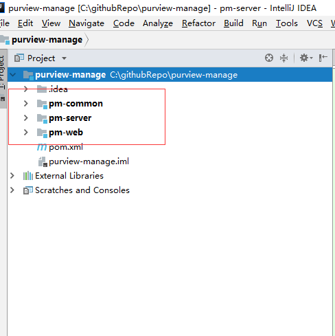

#### 2.3 添加Model依赖
1. 父工程的pom配置
首先声明该父工程包含的子模块已经Springboot相关配置，下面展示一些通用配置，具体含义可以对照注释
```xml
<?xml version="1.0" encoding="UTF-8"?>
<project xmlns="http://maven.apache.org/POM/4.0.0"
         xmlns:xsi="http://www.w3.org/2001/XMLSchema-instance"
         xsi:schemaLocation="http://maven.apache.org/POM/4.0.0 http://maven.apache.org/xsd/maven-4.0.0.xsd">
    <!--基本信息-->
    <description>权限管理系统</description>
    <modelVersion>4.0.0</modelVersion>
    <packaging>pom</packaging>

    <!--工程说明-->
    <groupId>com.crossrainbow</groupId>
    <artifactId>purview-manage</artifactId>
    <version>1.0-SNAPSHOT</version>

    <!--继承说明：SpringBoot父工程-->
    <parent>
        <groupId>org.springframework.boot</groupId>
        <artifactId>spring-boot-starter-parent</artifactId>
        <version>2.0.5.RELEASE</version>
        <relativePath/>
    </parent>

    <!-- 模块说明：声明多个子模块 -->
    <modules>
        <module>pm-common</module>
        <module>pm-server</module>
        <module>pm-web</module>
    </modules>

    <!--版本说明：统一管理依赖的版本号-->
    <dependencyManagement>
        <dependencies>
            <dependency>
                <groupId>com.crossrainbow</groupId>
                <artifactId>pm-web</artifactId>
                <version>0.0.1-SNAPSHOT</version>
            </dependency>
            <dependency>
                <groupId>com.crossrainbow</groupId>
                <artifactId>pm-server</artifactId>
                <version>0.0.1-SNAPSHOT</version>
            </dependency>
            <dependency>
                <groupId>com.crossrainbow</groupId>
                <artifactId>pm-common</artifactId>
                <version>0.0.1-SNAPSHOT</version>
            </dependency>
        </dependencies>
    </dependencyManagement>
    
</project>
```
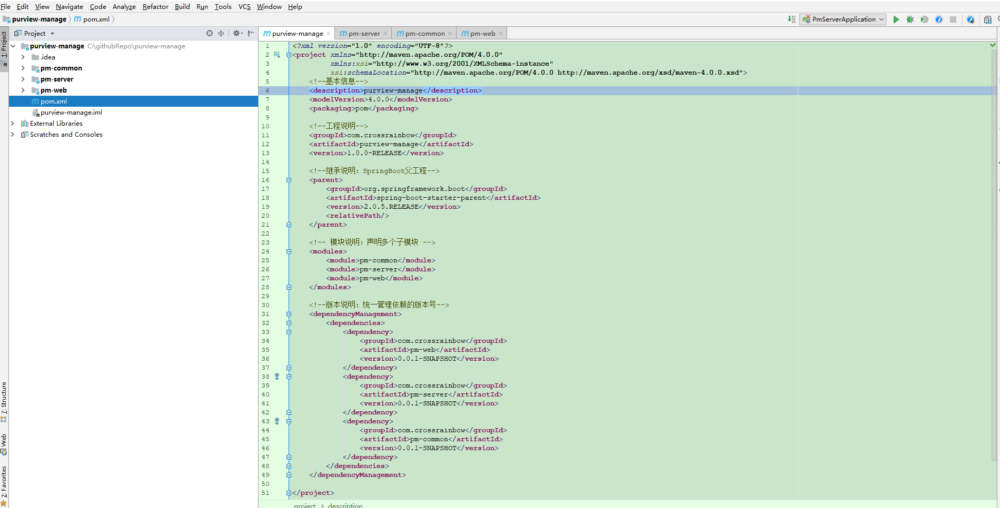

2. 子Model依赖配置 
以示例工程为例，我们将 
> * pm-web作为Web层
> * pm-server作为服务层
> * pm-common作为公共层  

三者的依赖关系为：
> * pm-web依赖pm-server
> * pm-web依赖pm-common
> * pm-server依赖pm-common

首先我们在三个model的pom文件中增加父工程配置
```xml
 <parent>
     <groupId>com.crossrainbow</groupId>
     <artifactId>purview-manage</artifactId>
     <version>1.0.0-RELEASE</version>
     <relativePath>../pom.xml</relativePath>
</parent>
```
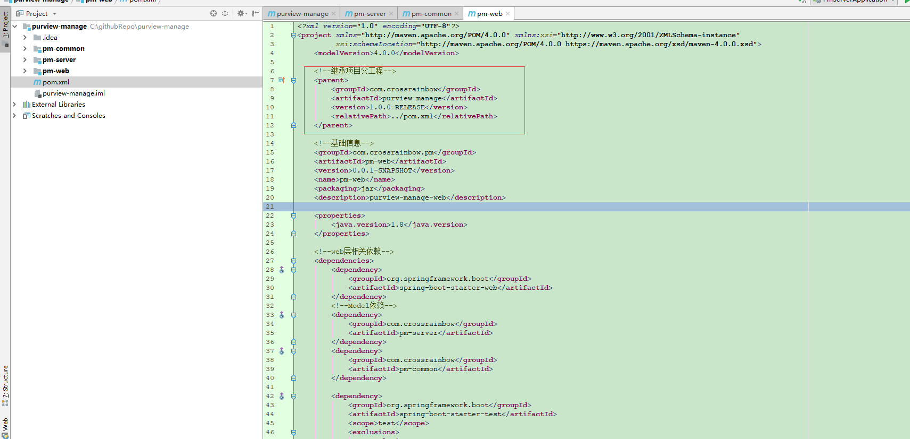

然后在web和server的pom文件新增依赖配置
>* pm-web下的pom文件增加
>>```xml
>><dependency>
>>	<groupId>com.crossrainbow.pm</groupId>
>>	<artifactId>pm-server</artifactId>
>></dependency>
>><dependency>
>>	<groupId>com.crossrainbow.pm</groupId>
>>	<artifactId>pm-common</artifactId>
>></dependency>
>>````
>>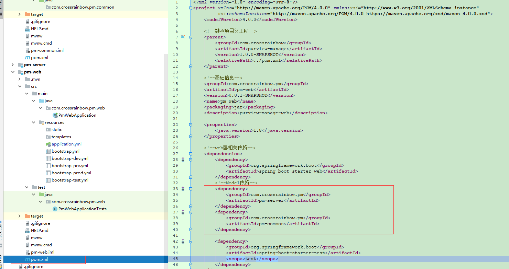
>* pm-server下的pom文件增加
>>```xml
>><dependency>
>>	<groupId>com.crossrainbow.pm</groupId>
>>	<artifactId>pm-common</artifactId>
>></dependency>
>>```
>>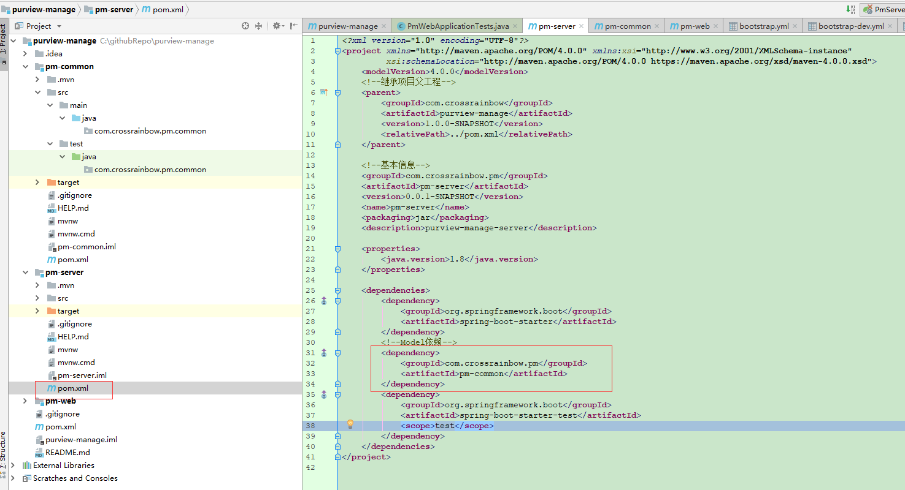

### 3. 工程配置
#### 3.1 打包配置
**注意**：多模块项目仅仅需要在启动类所在的模块添加打包插件即可，不要在父类添加打包插件，因为那样会导致全部子模块都使用spring-boot-maven-plugin的方式来打包
本示例启动模块是pm-web，只需要在该model下的pom文件添加打包插件即可
```xml
<plugin>
    <groupId>org.springframework.boot</groupId>
    <artifactId>spring-boot-maven-plugin</artifactId>
</plugin>
```
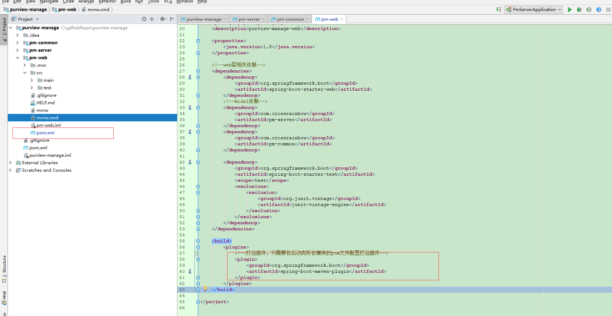

因为本示例启动模块是pm-web，所以可以将pm-common和pm-server中的启动类和resources文件夹删除
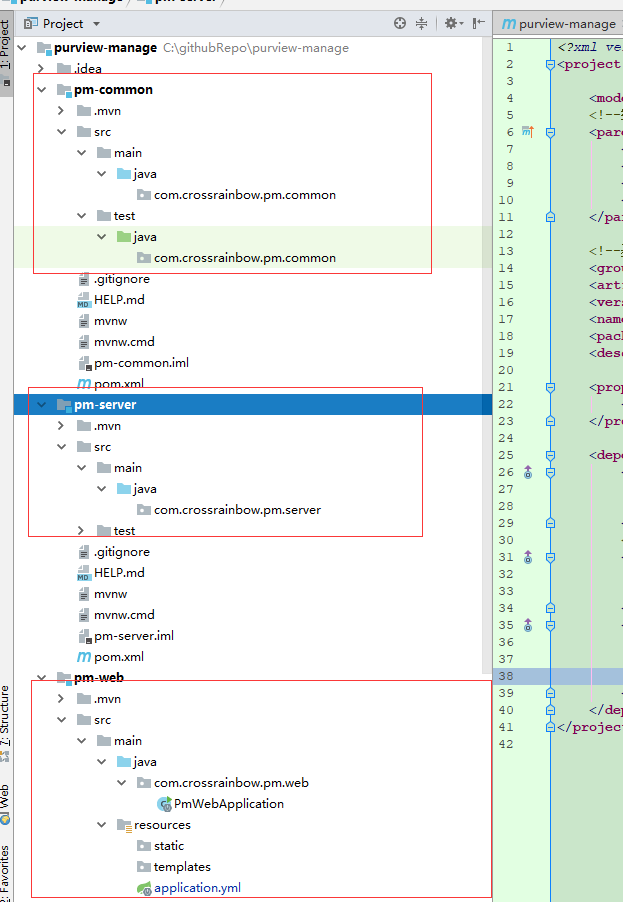

#### 3.2 多环境配置
在实际项目开发中，我们基本上会有多种环境，我们开发时需要能够灵活的切换不同环境，因此我们需要配置多环境来实现环境切换和减少部署时的配置工作，本示例中假设了有四种环境
> 1. dev(开发环境)
> 2. test(测试环境)
> 3. pre(预生产环境)
> 4. prod(生产环境)

1. 首先在启动类所在的model下的pom文件中增加环境配置和资源配置（本示例的pm-web下）
```xml
 <!--环境配置-->
    <profiles>
        <!-- 开发 -->
        <profile>
            <id>dev</id>
            <properties>
                <spring.profiles.active>dev</spring.profiles.active>
            </properties>
            <activation>
                <activeByDefault>true</activeByDefault>
            </activation>
        </profile>
        <!-- 测试 -->
        <profile>
            <id>test</id>
            <properties>
                <spring.profiles.active>test</spring.profiles.active>
            </properties>
        </profile>
        <!-- 预生产 -->
        <profile>
            <id>pre</id>
            <properties>
                <spring.profiles.active>pre</spring.profiles.active>
            </properties>
        </profile>
        <!-- 生产 -->
        <profile>
            <id>prod</id>
            <properties>
                <spring.profiles.active>prod</spring.profiles.active>
            </properties>
        </profile>
    </profiles>
```

```xml
<plugin>
    <groupId>org.apache.maven.plugins</groupId>
    <artifactId>maven-resources-plugin</artifactId>
    <executions>
        <execution>
            <id>default-resources</id>
            <phase>validate</phase>
            <goals>
            	<goal>copy-resources</goal>
            </goals>
            <configuration>
                <outputDirectory>target/classes</outputDirectory>
                <useDefaultDelimiters>false</useDefaultDelimiters>
                <delimiters>
                	<delimiter>#</delimiter>
                </delimiters>
                <resources>
                    <resource>
                    	<directory>src/main/resources</directory>
                        <!--先排除所有的配置文件-->
                        <excludes>
                        	<exclude>bootstrap*.yml</exclude>
                        </excludes>
                    </resource>
                    <resource>
                        <directory>src/main/resources</directory>
                        <!--引入所需环境的配置文件-->
                        <filtering>true</filtering>
                        <includes>
                            <include>application.yml</include>
                            <include>bootstrap.yml</include>
                            <include>bootstrap-${spring.profiles.active}.yml</include>
                        </includes>
                    </resource>
                </resources>
            </configuration>
        </execution>
    </executions>
</plugin>
```
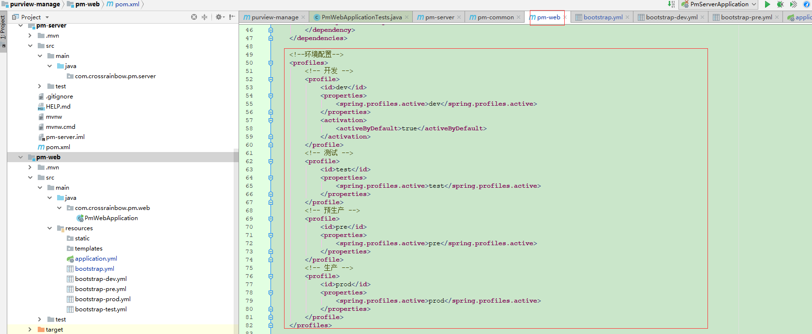
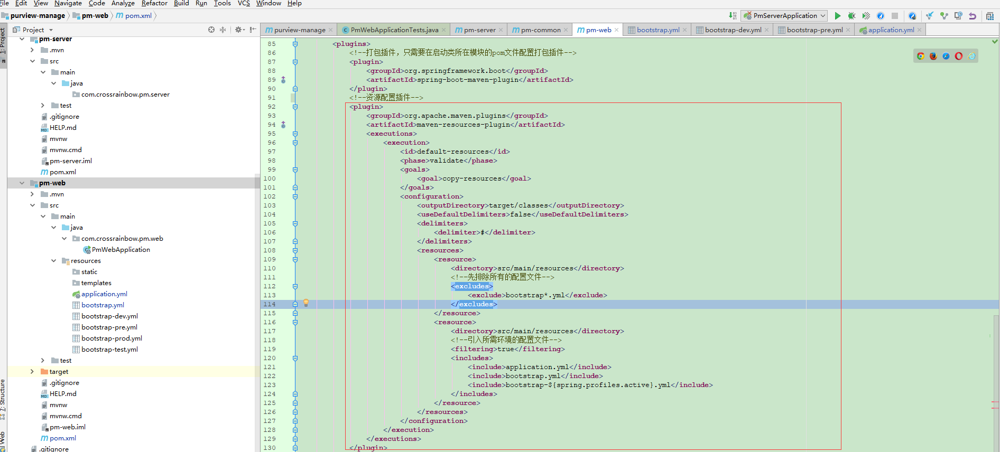

2.在pm-web下新增一下配置文件
>1. bootstrap.yml
>2. bootstrap-dev.yml
>3. bootstrap-test.yml
>4. bootstrap-pre.yml
>5. bootstrap-prod.yml

**注**：因示例项目使用springcloud，所以使用bootstrap的配置文件进行多环境配置，日常也可以使用application-${environment}.properties进行配置，方式相同。

3.我们再bootstrap.yml中新增环境配置和应用配置
```yml
# 应用名称
spring:
  application:
    name: purview-manage
# 加载环境
spring:
  profiles:
    active: #spring.profiles.active#
```
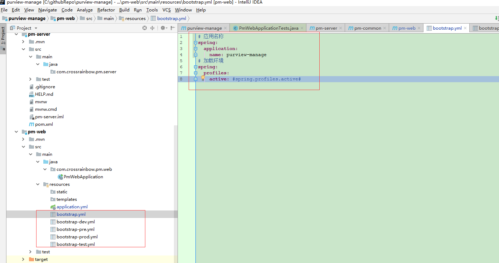

### 4.工程部署
#### 4.1 打包
* 使用maven指令进行打包
> 进入工程路径下打开命令行，在命令行输入：**mvn clean package -Dmaven.test.skip=ture -P dev**
> 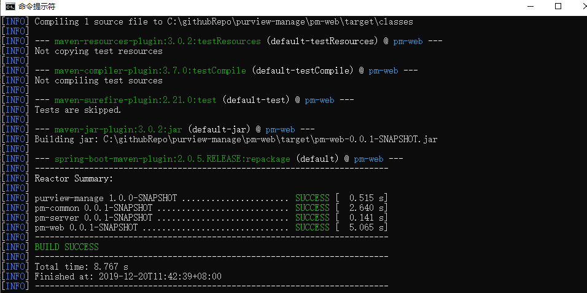

* 使用IDEA打包
> 直接在idea中pm-web下使用clean和package两个操作进行打包
> 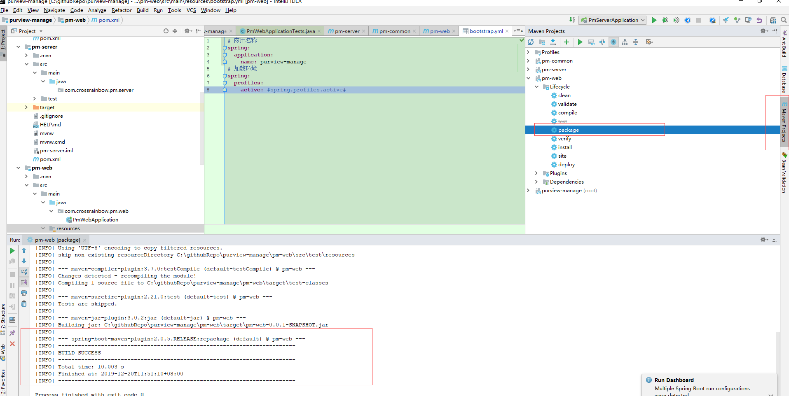

两种打包方式所生成的包都存在对应model的target目录下
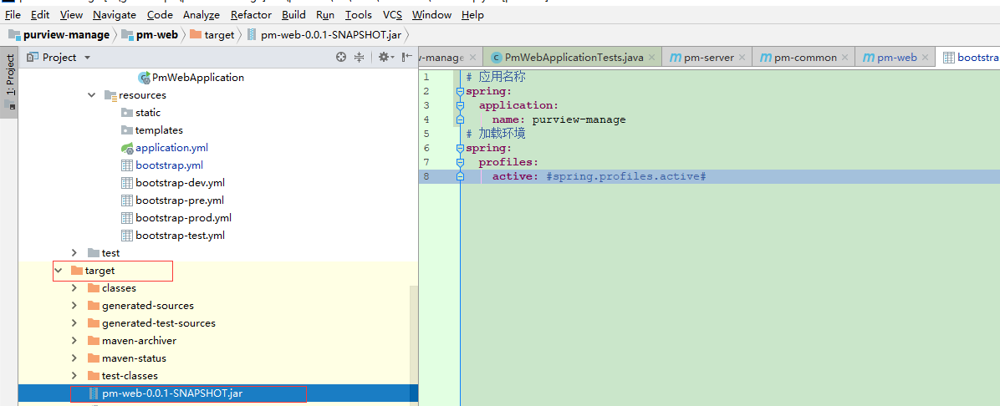


#### 4.2 启动环境

首先我们现在application.yml(properties)中配置应用名称和应用端口
```yml
# 应用名称
spring:
  application:
    name: purview-manage
# 端口号
server:
  port: 8089
```
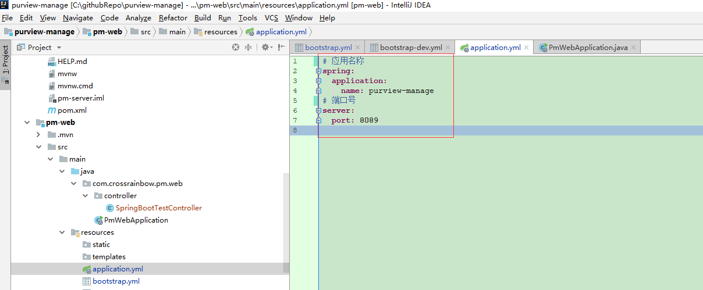

然后我们新增一个测试类用于启动测试
```java
package com.crossrainbow.pm.web.controller;

import lombok.extern.slf4j.Slf4j;
import org.springframework.web.bind.annotation.*;

/**
 * @description:
 * @author:Peanutfs
 * @date:created in 11:54 2019/12/20
 */
@Slf4j
@RestController
@RequestMapping("/hello")
public class SpringBootTestController {

    @GetMapping("/h1")
    @ResponseBody
    public String hello(){
        return "Hello World!";
    }
}

```
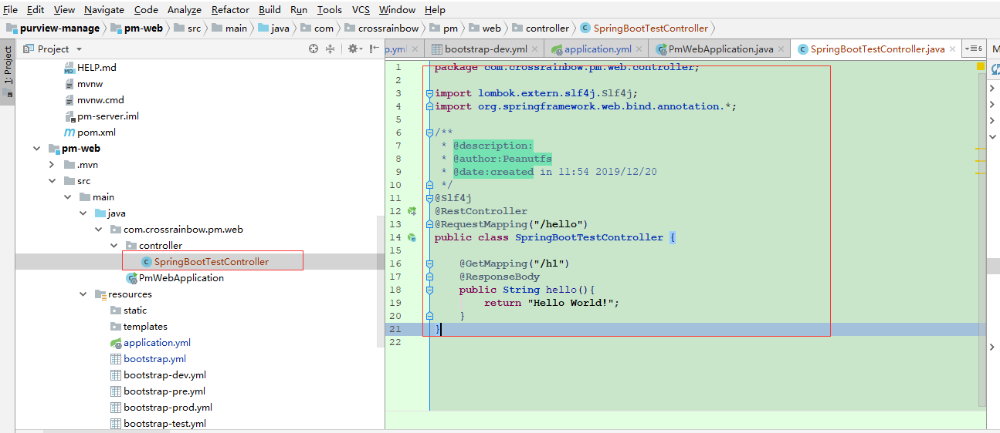

* IDEA启动
idea 打开应用的启动类PmWebApplication在main方法上点击Run
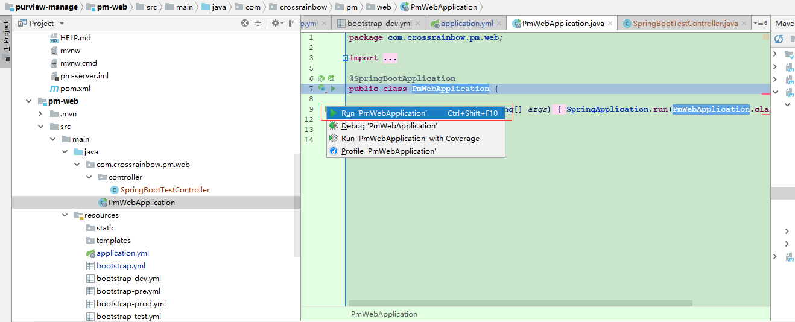
启动后控制台将输出日志
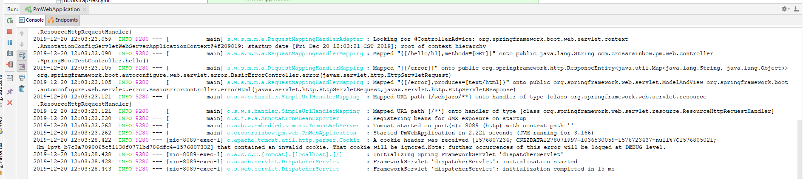
启动完成后在浏览器中输入**localhost:8089/hello/h1**将看到
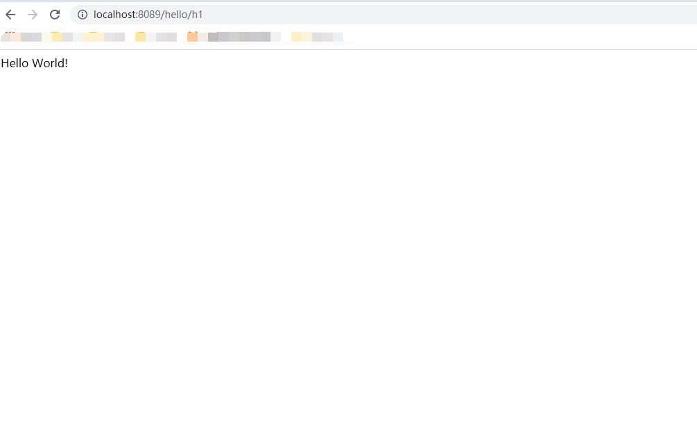
证明应用已启动

* 命令行启动
在应用包路径下打开命令行输入**java -jar pm-web-0.0.1-SNAPSHOT.jar**
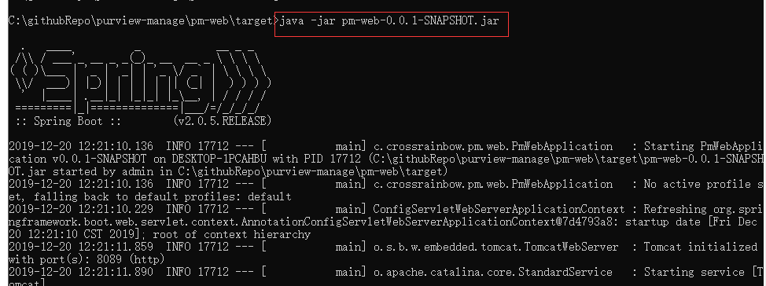
启动完成后在浏览器中输入**localhost:8089/hello/h1**将看到

证明应用已启动

至此我们就完成了一个简单的多Model SpringBoot工程搭建